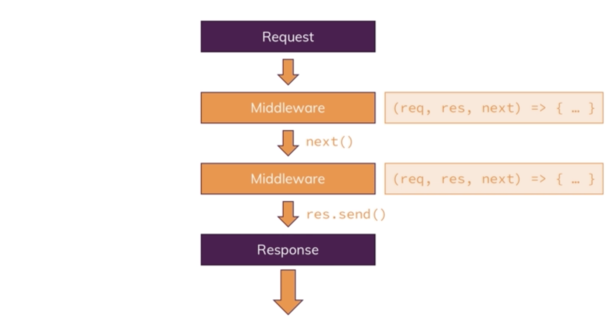
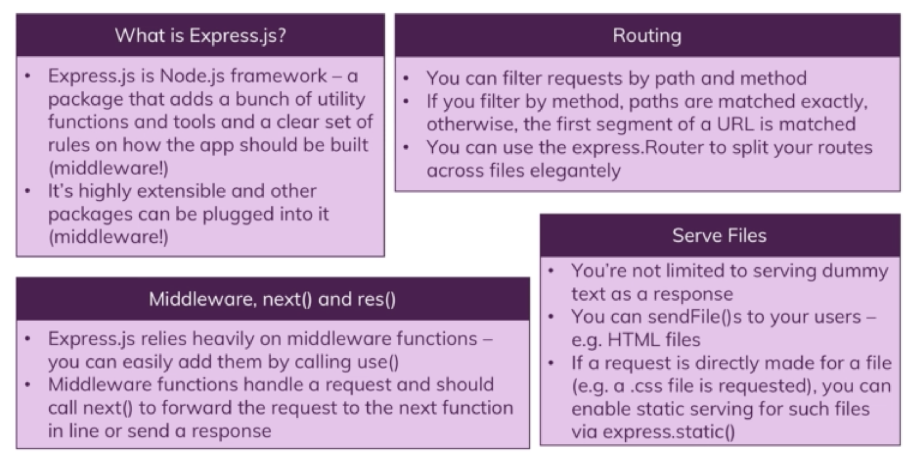

# ExpressJs

ExpressJS is a popular NodeJS framework. It is used on top of NodeJS to give a much easier and smoother flow to Node development. Some advantages of express are:
- Makes development of server logic easier
  - Allows you to really focus on business logic rather than reinvent the wheel
- Highly felxible and very extensible
  - Many packages and plugins available
### Middleware
ExpressJS is all about middleware. The middleware of the framework handles how the request flows through the application, and also decides how to respond.



Middleware is added to the app by calling
```javascript
app.use([path,], callback, [callbacks,])
```

Express also provides functionality for requests and responses:
- Body parser: Must be installed seperately. Allows the request body to be easily read
- res.send, res.json, res.sendFile etc are all methods which set headers for the response for you

### Filtering, Navigation and Serving:
**Filtering**<br>
Express router can be used to seperate the routes from the main app and rather putting them into logical files like admin.js or home.js etc. The router can then be exported from these pages and imported in the main app. The main app can then be used to filter the routes:

```javascript
const adminRoutes = require('./routes/admin');

app.use('/admin', adminRoutes);
```

In the above snippet, the routes in admin will now only be accessable is '*/admin*' leads the rest of the request.

**Serving**<br>
Express can also be used to serve static pages, including HTML, CSS, JS and any other file that needs serving. HTML files are served by creating the HTML file that needs serving and simply calling:
```javascript
res.sendFile(path.join(__dirname, 'pathToFileFrom dir'));
```

The response will then serve the html page to the client.

Serving CSS, JS and other assets the app might use is a little trickier, since these requests are not explicitly made by the browser, but rather are embedded within the HTML pages. The requests will attempt to access the assets in a public folder for instance. Express automatically blocks this as we do not want users being able to just browse through any folder they want in our codebase. The folder thus has to made public for serving on request by node as follows:
```javascript
app.use(express.static(path.join(__dirname, 'pathToAssets')));
```

The folder containing all assets is now publicly accessible. However, the only trick is now when a request is made for these files, the absolute url is no longer used. It must now be relative to the public assets folder, ie if there was a main.css file within the folder, you'd simply request it like:
```html
<link rel="stylesheet" href="main.css">
```

This is because the static file request is automatically directed into the public folder, and the URL delt with from within that folder

**Navigating**<br>
__dirname is commonly used for absolute directories in express. However, it can become frustrating because it does not give the main app path, it gives the current directory path that you are in. This can be resolved by adding a custom nav file which always returns the root directory of the project:
```javascript
const path = require('path');

module.exports = path.dirname(process.mainModule.filename);
```

Importing this file will always yield the root dir of the application

### Summary:



