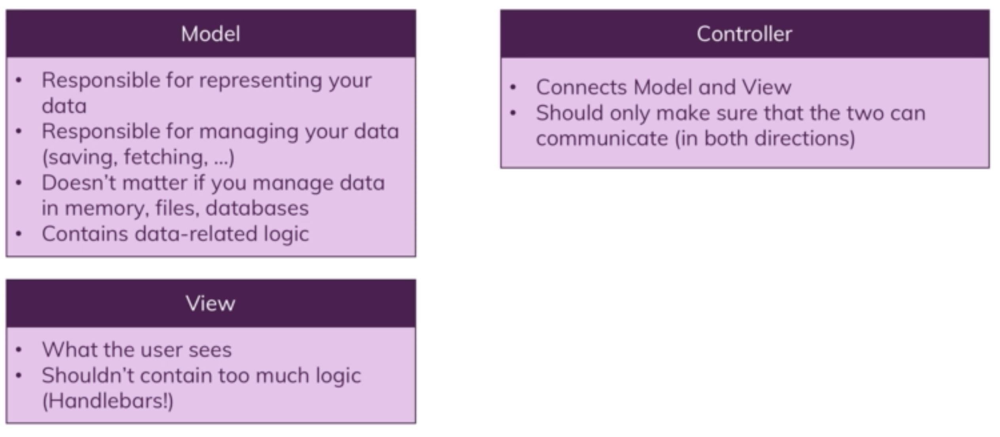

# MVC
MVC is about seperation of concerns - different parts of the code are responsible for different concerns.
- Models - Objects or part of code responsible for representing your data, allows to work with data
  - Contains all data related logic (saving, fetching etc)
- Views - What the user sees, decoupled from application code
  - Presents data to user
- Controllers - Connection between models and views, controller works with models and passes data to views (in-between logic)
  - Routes define which controller code should execute based on method and url
  - Controllers are split across middleware logic
  - Ensures views and models can communicate

