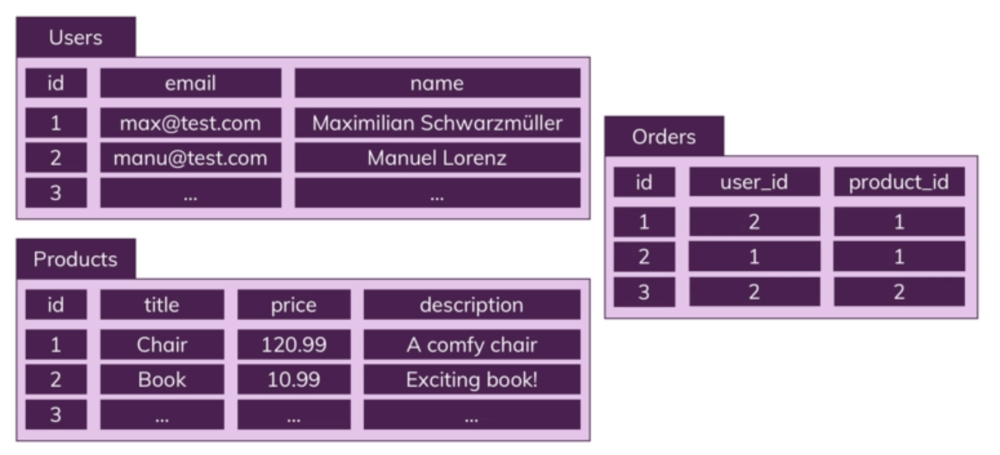
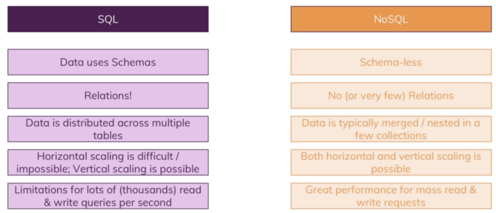

# SQL
---


## SQL vs noSQL
**SQL:**
Sql makes use of tables with columns/fields. Data that is stored in these fields is called a record (the row)
Sql database tables can be related, relational DB. Each table has a strong/strictly defined data schema.



Tables are also related. Data within tables can be related with different types of relationships:
- One to one
- One to many
- Many to many
SQL uses queries to interact with the DB

**NoSQL**
Has collections, rather than tables. Collections store documents, rather than records. Doesn't have a strict schema, documents within the same collection can have different structures. instead of relations, NoSQL uses duplicate data (nests a document in a document within another collection where needed). Means that joins are not necessary.

Characteristics:
- No schema
  - No structure required
- Rarely has data related
## Horizontal and Vertical Scaling
**Horizontal Scaling**
Add more servers and merge data into one DB. Can be complex to merge data with SQL queries. Can expand 'infinitely'

**Vertical Scaling**
Make existing system stronger by adding more CPUs or Memory. Limited to power of one machine.





SQL can be better for applications that require hard schemas.

### SQL with Node
To use sql with node, install the mysql2 npm package. Then, in a db utility file, add:
```javascript
const mysql = require('mysql2');

const pool = mysql.createPool({
  host: 'localhost',
  user: 'root',
  database: 'node-complete',
  password: 'password'        // Whatever your password is
});

module.exports = pool.promise();
```

This can then be required in other files, and the execute function can be called to send a query to the db.
