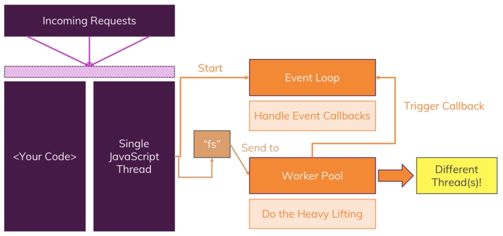
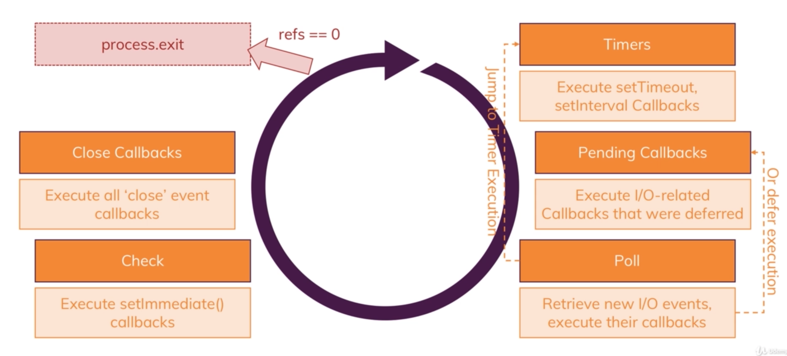

# NodeJs - Basics

## Requests and Responses:

To create a server with a request listener:
```javascript
const server = http.createServer((req, res) => {
    res.setHeader('Content-Type', 'text/html');
    res.write(<random html>);
    res.end();
});
    
```

To use different paths, can check req.url and branch conditionally:
```javascript
const url = req.url
if (url === '/whatever') {
    do this;
}
```

**Handling form submission:**

form**:** 
```html
<form action="/message" method="POST">
    <input type="text" name="message">
    <button type="submit">
        Send
    </button>
</form>
```

The form will now submit a POST request to '/message'. This can be checked for in the request listener:
```javascript
const server = http.createServer((req, res) => {
    const url = req.url;
    const method = req.method;
    if (url === '/message' && method === 'POST') {
        // Handle request here
    }
    res.setHeader('Content-Type', 'text/html');
    res.write(<random html>);
    res.end();
});
```

---

### Streams and Buffers:
**Incomming request:**
- The request is read in individual chunks so that we can start working on individual chunks without waiting for whole req to be parsed
  - **Stream** => **Req Body part 1** => **Req body part 2** => ... => **Fully Parsed**
  - Especially true when we need to write to disk, so data can be written to disk while it is still comming in
- To organise/hold these chunks, use buffers
The parsed message can then be stored, and perhaps written to a file using the node fs module. Obtaining the data requires using request event listeners, namely listening for incoming data, and listening for the end of the message. The snippet below show how data can be pushed into an array when data is received, and can then be parsed into a string after the end of the chuck/request is triggered. The output is then written to a file:
```javascript
if (url === '/message' && method === 'POST') {
    const body = [];
    req.on('data', (chunk) => {
      body.push(chunk);
    });
    req.on('end', () => {
      const parsedBody = Buffer.concat(body).toString();
      const message = parsedBody.split('=')[1];
      fs.writeFileSync('message.txt', message);
    });
    res.statusCode = 302;
    res.setHeader('Location', '/');
    return res.end();
  }
```

Above, there are 2 event listeners that are registered, on data and on end. This means that they are not going to execute them immediately. The functions are registered internally on the event emitter registery. The code is nonblocking and thus sequential code will be executed before the callback is excuted, which may cause errors if not accounted for. We do not want blocking code, because it will slow down the server and responses.

---
### Blocking and non blocking code:
Node uses an event driven architecture. Node js offloads processors to the OS, which is multi threaded, and then continues it's event loop to listen to further event callbacks, and then dispatches tiny actions to the OS, and then returns to the OS to fetch the result once it is done. Certain code is blocking, such as writeFileSync, which is synchronous and blocking. This can greatly slow the server down. Thus, writeFile should be used instead:
```javascript
fs.writeFile('message.txt', message, (err) => {
    // This is the callback that is called when the write is completed
    // Error handling can also be handled here
});
```

In the previous snippet on parsing the POST request, issues may arise where code after the if statement could be executed before the call back, leaving errors in attempting to send the response. To avoiud this, the event listener itself can be returned to ensure that the request listener that callback lies in, exits after it has seen the callback.

```javascript
if (url === '/message' && method === 'POST') {
    const body = [];
    req.on('data', (chunk) => {
      body.push(chunk);
    });
    retuen req.on('end', () => {
      const parsedBody = Buffer.concat(body).toString();
      const message = parsedBody.split('=')[1];
      fs.writeFileSync('message.txt', message);
    });
    res.statusCode = 302;
    res.setHeader('Location', '/');
    return res.end();
  }
```

This non blocking architecture makes nodejs very high performance, allowing for very quick responses from the server.

---
### Behind the Scenes:
NodeJS uses one single JS thread. How does it handle multiple requests? Is it secure? Can you access data of request A from request B?

Node uses the event loop to handle event callbacks. It is automatically started by Node when the program starts. The event loop handles the callback code when it executes. The event loop doesn't handle code that takes long to execute. Heavier, longer taking tasks are sent to a worker pool which is also created and managed by Node. The worker pool is almost entirely detached from the JS. It can spin up multiple threads and is closely linked with the os. The one connection to the event loop that the worker pool has, is that when the task is done, the worker pool will trigger the callback, which is then handled by the event loop.





This is all handles by NodeJS, and is not explicitly coded.

The event loop keeps the Node process running, and handles all the callbacks. At the beginning of each loop it checks if there are any timer callbacks that it should execute, setTimeout(). Thereafter, it checks for any other pending callbacks such as I/O callbacks. If there are too many callbacks, Node will first execute a few of the callbacks and then continue with the loop, and execute the callbacks on the next iterartion. After executing all of the callbacks, node continues into a poll phase. The poll phase is when node looks for new IO events and try to execute the callbacks. If not possible, it will defer the callback. The poll also checks to see if there are timer callbacks, and jumps straight back to the timer phase if it finds any. Next, it checks setImmediate() callbacks, which execute the callbacks immediately, but only after any open cvallbacks have been excuted. The event loop then eb=nters the clos callbacks phase where any close events registered are executed. Finally, the loop may exit if there are no remaining event listeners. However, a server will always be left in a listening state and therefore continue looping. The event loop has an event listener/callback counter that is incremented everytime a calback is registered and decremented every time a event listener/callback is completed.





Different request are seoperate and therefore not at security request becausew the server request listener is executed seperatly for each request.

---
### Imports and Exports
To export a fucntion, or variable, or class:
```javascript
module.exports = randomFunction;
```

Mulitple variables and functions can also be exported:
```javascript
module.exports = {
    handler: randomEventHandlerFunc,
    word: "word"
}
```

When importing modules, the file must be used for the import. If a file, route.js, containes modules, the import is as follows:
```javascript
const routes = require('./route');
```
---
### Module summary
**How the web works:**

Client => Request => Server => Response => Client

**Prgram Lifecycle & Event Loop:**
- Nodejs runs non blocking JS code and uses event driven code (Event loop) to run logic
- Node process terminates when there is no more work to do
- createServer() never finishes by defualt
**Asynchronous:**
- JS is non blocking
- Uses callbacks and events
  - Order changes
**Request & Responses**
- parse responses in buffers and chunks
- Avoid double responses with async code
**NodeJS and Core Modules**
- http, fs, path ...
- Can be imported into any file
- Import via require
**Node Module System**
- Import via require for core & 3rd party modules
- Export via module.exports
