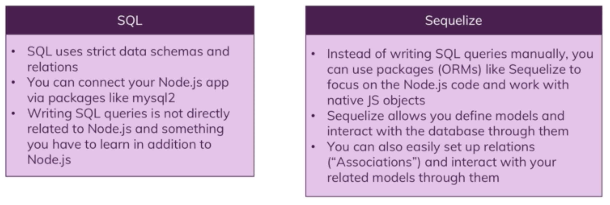

# Sequalize
Sequelize is an ORM for SQL. An ORM maps objects to the database. Sequelise allows us to define models by defining what data makes up a model, the models can then be instantiated or used for utility functions. The instantiated model or utility functions can then be used to create queries. Sequelize can also associate models.

## Creating a model:
To create a sequelise model, sequelise provides a define function:
```javascript
const Product = db.define('product', {
  id: {
    type: Sequelize.INTEGER,
    autoIncrement: true,
    allowNull: false,
    primaryKey: true
  },
  title: {
    type: Sequelize.STRING,
    allowNull: false
  },
  price: {
    type: Sequelize.INTEGER,
    allowNull: false
  },
  description: {
    type: Sequelize.STRING,
    allowNull: false
  },
  imageUrl: {
    type: Sequelize.STRING,
    allowNull: false
  }
});
```
Above, a product model is created with several properties (columns). Each property is an object which should at least describe it's type. Several other properties, like defaults, primary key etc can be set within this object.

Once the model has been defined, it can be exported and the various sequelise methods provided by it's API can be used to save, create, update and delete items within the table.

## Creating relationships
In SQL, there are 3 types of relationships, one to one, one to many and many to many. These relationships can be specified using sequelise, which then takes care of foreign keys and provides certain functions to handle these relationships. The relationships are defined as follows:

```javascript
/* One to one: */
User.hasOne(Cart);

/* One to many */
Cart.hasMany(CartItem);

/* Many to Many */
Cart.belongsToMany(Product);
Product.belongsToMany(Cart);
```

### Summary


